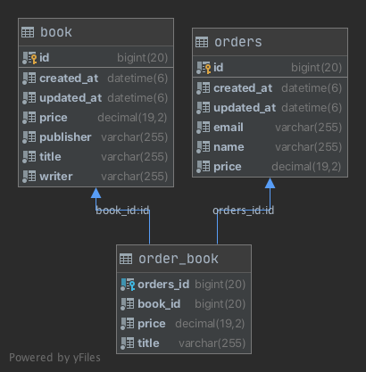

# 다루는 내용
* [ ] IntelliJ Tip
* [ ] Kotlin
* [ ] Spring Boot / Web MVC / Data JPA / H2
* [ ] Actuator
* [ ] Web MVC DSL
* [ ] JPA Test Support
* [ ] Web MVC Test Support
* [ ] Domain Test Support


# Branch
1. `git checkout step-0`
2. `git checkout step-1`
3. `git checkout step-2 `
4. `git checkout step-3`
5. `git checkout step-4`


# Step-0

## 인텔리제이 플러그인
* [ ] Grep
* [ ] Rainbow Brackets, Rainbow Intent
* [ ] GitToolbox
* [ ] Key Promoter
* [ ] Lombok
* [ ] Translation
* [ ] VisualVM Launcher


## 인텔리제이 활용

[IntelliJ Tip](https://github.com/cheese10yun/IntelliJ)

* [ ] Find Action
  * [ ] Open File
  * [ ] Gradle CMD + 9
* [ ] Http Client
* [ ] Actuator End Point
* [ ] 특정 Import 제외하기
* [ ] Execute Gradle Task 사용하기
* [ ] Refactoring
    * [ ] move
    * [ ] copy
    * [ ] introduce variable
    * [ ] Property
    * [ ] introduce Parameter
    * [ ] Pull Members Up
* [ ] 다중 라인
* [ ] live template
    * [ ] todo, fixme, String, private, psvm
* [ ] 문자열
    * [ ] 동일 문자열 ⌘ + ⌃ + g
    * [ ] 동일 위치열 ⌥ + drag
    * [ ] 복사 히스토리 command + shift + v를
* [ ] Github 사용법
    * [ ] Github 연동
    * [ ] Share Project
    * [ ] Gist
    * [ ] Task Issue 연동, Task 기반 branch 생성
    * [ ] [Github Code Review](https://cheese10yun.github.io/intellij-code-review/)
* [ ] Git
    * [ ] Commit, Push, Pull
    * [ ] Stash, UnStash
    * [ ] Branch, Branch Diff, Merge, Checkout
* [ ] Srping
  * [ ] Health
  * [ ] Mappings

# Step-1

## Actuator
* [Actuator 참고](https://github.com/cheese10yun/blog-sample/tree/master/actuator)

## Kotlin 장점 ?

### 필요한 설정

```gradle
plugins {
    id("org.springframework.boot") version "2.3.1.RELEASE"
    id("io.spring.dependency-management") version "1.0.9.RELEASE"
    kotlin("jvm") version "1.3.72"
    kotlin("plugin.spring") version "1.3.72"
    kotlin("plugin.jpa") version "1.3.72"
}

allOpen {
    annotation("javax.persistence.Entity")
    annotation("javax.persistence.MappedSuperclass")
    annotation("javax.persistence.Embeddable")
}
```
* Spring + Kotlin + JPA를 사용하기 위해서는 위 플러그인을 설정해야함


# Step-2
* 책 주문 도메인 객체, 엔티티 객체 설계
* Domain Builder for Test

## ERD


* Order를 통해서 Book을 주문할 수 있음

# Step-3
* Repository, Service 개발
* Test Code를 위한 JPA Support for test 개발

# Step-4
* API 개발
* Web MVC DSL 기반으로 테스트 코드 작성
* IntelliJ HTTP Client 사용방법
* Swagger 사용방법